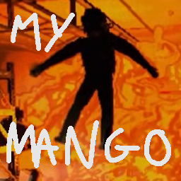

# LCMyMango

Simple mod that if you scream you get blown up.

## Config

### VoiceThreshold

Determines the minimum avarage voice loudness that should make the mod
start considering whether to spawn a landine under you. This value is
not synced with the host.

<b>[NOTE]</b>: It is heavily recommended to change this value from it's default one,
as not all microphones were made equal!

### TimeUntilExplode

Determines how long does your voice's avarage loudness have to go above the
VoiceThreshold value to spawn a landmine.

### ExplodeCooldown

Determines after spawning a landmine how long do you have to wait.

### This mod uses small snippets of code from:

- [MetalRecharging](https://github.com/legoandmars/MetalRecharging) by <b>legoandmars</b>: landmine spawning functionality
- [LCNameplateTweaks](https://github.com/taffyko/LCNameplateTweaks) by <b>taffyko</b>: detecting push to talk key pressed

### Required dependencies:

- [LethalNetworkAPI](https://github.com/Xilophor/LethalNetworkAPI) by <b>Xilophor</b>

### Optional dependencies:

- [LobbyCompatibility](https://github.com/MaxWasUnavailable/LobbyCompatibility) by <b>MaxWasUnavailable
</b>
